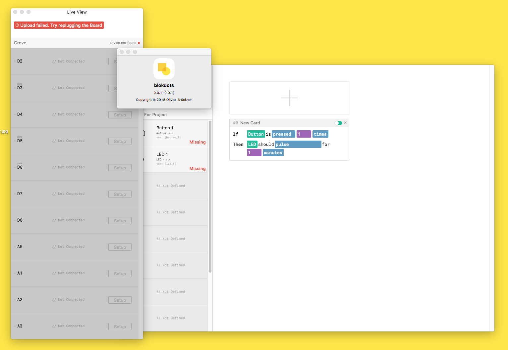

# blokdots
Hi, this is blokdots, a system to make hardware prototyping easier. Visit the [website](http://blokdots.com) if you want to know more.



## Why
Look at the [about page](https://blokdots.com/about.html) to find out more.
  
## Hardware Setup
Just use the [grove setup](https://www.seeedstudio.com/category/Grove-c-1003.html?p=0) by SEEED Studio, e.g. the [Grove Arduino shield](https://www.exp-tech.de/module/seeed-grove-system/4778/seeed-studio-grove-base-shield-v2), plug in your actuators and sensors and start prototyping using this software!

## Dev Setup
To install the software *(alpha)* download the package, open it in terminal and hit ```$ npm install```

## API
Currently blokdots is running through the powerful [Johnny-Five](http://johnny-five.io) framework, so after setting up your project in few simple steps using blokdots, you can easily continue working on it by changing the generated javascript. This way, you projects can get more advanced even after building you prototype using the simple IFTTT interface.

## Building App
Run this line to build a functioning Mac App:  
```sh  
$ npm run dist  
```

*Note:* because of some errors regarding the serialport package issue, ```buildDependenciesFromSource``` is set to ```true```.  
It will be saved in the "dist" folder within the main directory of blokdots.

### Together With
[Christoph Labacher](https://www.christophlabacher.com)  
[Nikolas Klein](http://nikolasklein.de)  
[Manuel Hollfelder](https://github.com/mhollfelder)